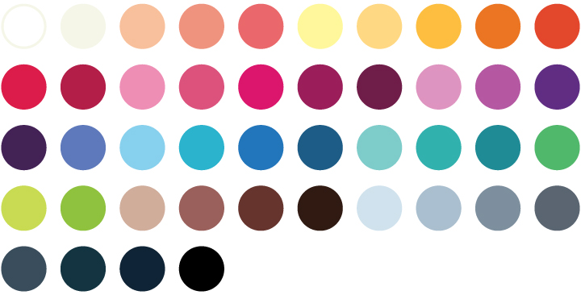

# Flat color palettes for Inkscape

## Gigantic Characters

A nice 45 flat colors palette for drawing characters. Original selection by [Gigantic](https://gigantic.store/gigantic-color-pallet/). Recreated for Inkscape by Francisco Sanchez Arroyo. Just copy the `characters.gpl` file to `/usr/share/inkscape/palettes/` (in Linux)

```bash
sudo cp characters.gpl /usr/share/inkscape/palettes/
```



## Vinyl sticker challenge

For the 36 layer vinyl sticker challenge I recreated the palette in Inkscape. To use it just copy the `arteza42.gpl` file to `/usr/share/inkscape/palettes/` (in Linux).

## How to create an Inkscape palette

Creating a palette in Inkscape is simple. Just create some shapes and fill them with the colors you want to have in your palette. When you have created all the colors, save the file as `.gpl`. Unfortunately Inkscape palettes are created sorting by the R (red) value. So will have to edit the textfile and sort the rows manually. Finally just copy the `.gpl` file to `/usr/share/inkscape/palettes/` (in Linux).
